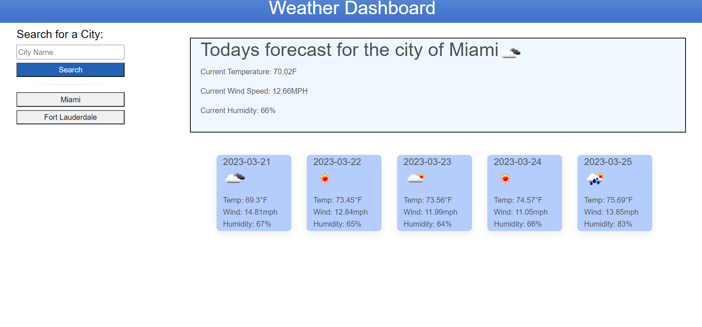

# Weather Dashboard

Welcome to my Weather Dashboard! I made this simple weather app with the goal of being able to plan and forsee the weather in the city I will be visiting in advance with 5 days ahead. Using the Open Weather Map API to get current day forecast and 5 day. I learned how to implement this specific API and get all the necesary information while also making a functional app that correctly takes input and returns error when incorrect. All you have to do is type your city name and it will load up the weather! It will save in local storage for next time and it will also load up automatically on refresh so you dont have to do any extra work. Enjoy.

# Screenshot

# Usage
Just click the link and check it out!
https://rockoban420.github.io/weather_app/